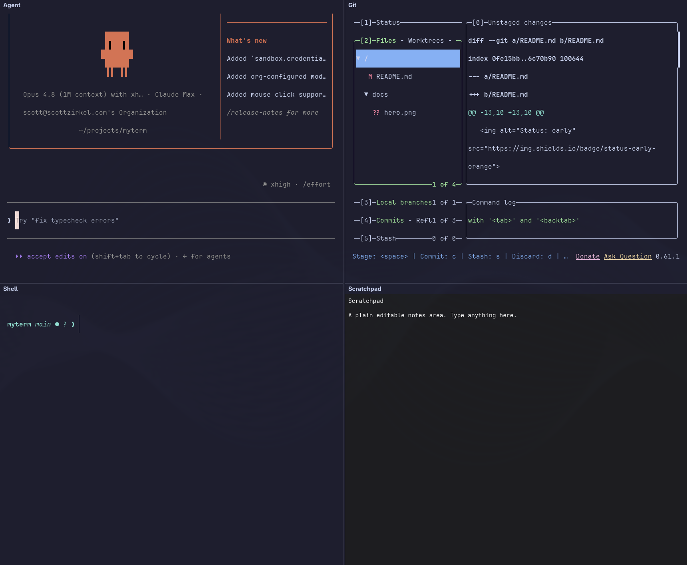

<h1 align="center">Roost</h1>

<p align="center">
  <strong>An agent command center for the terminal.</strong><br>
  A GTK4 workspace that puts your coding agent, git, shell, and notes in one
  window — built on real <a href="https://ghostty.org">Ghostty</a> terminals.
</p>

<p align="center">
  
  
  
  
</p>

<p align="center">
  
</p>
<p align="center"><sub>The default 2×2: Agent (Claude Code) · Git (lazygit) · Shell · Scratchpad</sub></p>

---

Roost is a single window for the way you actually work with AI coding agents: a
**role-typed, splittable workspace** of real terminal panes — your **agent**
(Claude Code), **lazygit**, a **shell** — alongside a wired **scratchpad**. It
remembers a **layout per project**, turns a branch into a **git worktree** in one
keystroke, and raises a **native notification** when your agent finishes or needs
you.

It's a Linux-native take on [supacode](https://github.com/supabitapp/supacode),
built the same way supacode is on macOS: on top of **real Ghostty terminal
surfaces** — GPU-accelerated, native, no Electron — rather than a web view or a
`tmux` reskin. The panes are just the substrate; the point is everything wired
*around* them.

## Features

- **Role-typed panes** — Agent, Shell, Git, Editor, and an in-app Markdown
  Scratchpad. The Agent pane runs `claude` (or `$ROOST_AGENT`); the Git pane runs
  `lazygit`; each falls back to your shell if the tool isn't installed.
- **Free-form pane tree** — split any pane, add a pane by role, close, or reset
  to the default 2×2. Not fixed quadrants — arrange it however you like.
- **Per-project layouts** — your arrangement (including split sizes) is saved and
  restored *per project directory*. Switch projects and the workspace reshapes to
  that project's own layout.
- **Git worktree command center** — `Ctrl+Shift+B` turns a branch name into
  `git worktree add …` and switches the whole workspace into the new worktree.
  `Ctrl+O` opens a chooser across recent projects and the current repo's
  worktrees.
- **Agent-aware notifications** — wire Roost into Claude Code's hooks and the
  Agent pane raises a desktop notification + a status badge when the agent
  finishes (`✓ done`) or needs you (`🔔 needs you`).
- **Scratchpad → Agent** — select text (or just a line) in the Scratchpad and
  `Ctrl+Enter` sends it straight to the Agent pane.
- **Inherits your Ghostty config** — fonts, theme, keybinds, and (on Omarchy)
  your current theme are read from your existing `~/.config/ghostty`.

## Requirements

- **Linux with a Wayland compositor.** Developed on
  [Omarchy](https://omarchy.org) / Hyprland; any GTK4 + Wayland setup should
  work.
- **GTK4 + libadwaita** (Ghostty's runtime deps).
- **[Zig](https://ziglang.org) 0.15.2** to build.
- Optional but recommended: **[lazygit](https://github.com/jesseduffield/lazygit)**
  (Git pane) and **[Claude Code](https://claude.com/claude-code)** (`claude`, the
  Agent pane).

## Install

Roost is an *additive overlay* on Ghostty, so Ghostty comes in as a git
submodule:

```sh
git clone --recurse-submodules https://github.com/scottzirkel/roost
cd roost

# One-time, only on Arch + Zig 0.15.2: work around the SFrame relocation
# (Zig #31272) by forcing LLVM/LLD. Skips itself if not needed.
scripts/patch-zig-linker.sh

# Build: overlays our source onto the pinned Ghostty checkout and compiles.
./build.sh                       # -> vendor/ghostty/zig-out/bin/roost
```

Put it on your `PATH`:

```sh
ln -s "$PWD/vendor/ghostty/zig-out/bin/roost" ~/.local/bin/roost
```

Optional — install the desktop launcher (edit `Exec=` to point at your clone
first):

```sh
cp scripts/roost.desktop ~/.local/share/applications/
```

## Usage

```sh
cd ~/code/my-project && roost     # open Roost in this project (its own window)
roost                             # open Roost in the current directory
ROOST_PROJECT=~/code/my-project roost
```

The project directory is resolved from `$ROOST_PROJECT`, else the current
directory — every pane (including lazygit) launches there. Launched from the
**desktop entry**, Roost is single-instance: a second launch forwards to the
project chooser instead of opening a stray window. From a **terminal** it's
always its own independent window.

### Keybindings

| Key | Action |
| --- | --- |
| `Ctrl+O` | Open the project / worktree chooser (recents, worktrees, open folder, new worktree) |
| `Ctrl+Shift+B` | Create a git worktree from a branch name and switch the workspace into it |
| `Ctrl+Enter` | Send the Scratchpad's selection (or current line) to the Agent pane |
| `Alt+1` … `Alt+9` | Focus pane by index |
| `Ctrl+Alt+←/→/↑/↓` | Focus pane by direction |
| `Ctrl+Shift+R` | Split the focused pane to the right |
| `Ctrl+Shift+D` | Split the focused pane downward |
| `Ctrl+Shift+A` / `S` / `G` / `E` / `N` | Add an Agent / Shell / Git / Editor / Scratchpad pane |
| `Ctrl+W` | Close the focused pane |
| `Ctrl+Alt+R` | Reset to the default 2×2 layout |
| `Ctrl+Q` | Quit (saves the layout) |

> Note: shifted-digit accelerators don't fire in GTK, which is why splits/roles
> use letters rather than numbers.

### Agent notifications

The Agent pane exports `ROOST_SOCK` into every pane. Wiring `scripts/roost-notify`
into Claude Code's `Stop` and `Notification` hooks lets the agent ping Roost:

```jsonc
// ~/.claude/settings.json  (see scripts/claude-hooks.json for the full snippet)
"hooks": {
  "Stop":         [{ "hooks": [{ "type": "command", "command": "/path/to/roost/scripts/roost-notify done" }] }],
  "Notification": [{ "hooks": [{ "type": "command", "command": "/path/to/roost/scripts/roost-notify needs-input" }] }]
}
```

Full setup is in [`scripts/README.md`](scripts/README.md). If `ROOST_SOCK` is
unset (not running under Roost), the helper does nothing and exits 0 — it can
never break your agent.

## Configuration

- **Terminal look & feel** is your existing Ghostty config (`~/.config/ghostty`),
  including the Omarchy theme — Roost reads it directly.
- **Layouts & recents** live in `~/.config/roost/` (one layout file per project,
  keyed by path).
- **App id** is `dev.scottzirkel.Roost` (set so Roost never collides with a real
  Ghostty instance).

## How it works

Roost's code relative-imports Ghostty internals, so it has to live *inside* the
Ghostty source tree to compile — but it never edits Ghostty's own files. So the
build is a clean overlay. `./build.sh`:

1. checks out the pinned Ghostty submodule (vanilla upstream, `v1.3.1`),
2. symlinks `src/roost/` + `src/main_roost.zig` into `vendor/ghostty/src/`,
3. applies `patches/build.zig.patch` — the one additive change, which registers
   the `roost` executable, and
4. runs `zig build roost`.

The diff against upstream Ghostty is *only* our own files plus that one build
step.

```
src/roost/            the workspace: panes, tree, layout, git, IPC, scratchpad
src/main_roost.zig    thin entry point
patches/              additive build.zig step
scripts/              roost-notify (agent hooks), roost.desktop, toolchain patch
vendor/ghostty/       Ghostty submodule (pinned, vanilla upstream)
build.sh              overlay + build
```

## Status & roadmap

Roost is **early but usable** — the core is complete and in daily use:

- ✅ Real Ghostty panes, free-form pane tree, per-project persisted layouts
- ✅ Git worktree create + switch, project/worktree chooser, recents
- ✅ Agent command + socket IPC → desktop notifications + status badge
- ✅ Scratchpad → Agent

Planned / known gaps:

- A real app **icon** (currently falls back to a generic icon)
- **`Ctrl+Z` in the Agent pane** suspends `claude` with no easy resume — needs an intercept
- Scratchpad **Markdown live-preview**, and **capturing agent output** back into it
- "New Worktree…" opening in a new window (today it switches the current one)

## Contributing

Issues and PRs welcome. Keep the **additive gate** intact — Roost adds files and
never edits Ghostty's source, so `git -C vendor/ghostty diff --name-only v1.3.1`
should only ever show `build.zig`.

## License

Roost's own code is **MIT** (see [LICENSE](LICENSE)). Ghostty is a separate
project (also MIT), consumed unmodified as a submodule.

## Acknowledgments

- [Ghostty](https://github.com/ghostty-org/ghostty) — the terminal that makes
  this possible.
- [supacode](https://github.com/supabitapp/supacode) — the macOS app that
  inspired the shape of this one.
